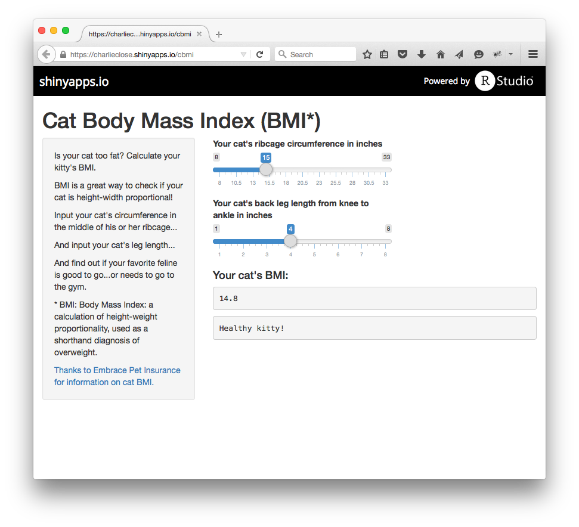

## Do you wonder if your cat just isn't the same these days?


Does he seem to drag himself to work in the morning? Is he not willing to go on brisk walks with you anymore?

Could it be the problem is that his height is out of balance with his weight&hellip;but you're just not sure and don't know enough science to find out?


--- .class #id 

## Now there's an Answer

Introducing the Cat BMI Calculator (CBMIC)<span style="vertical-align:super;font-size:12px">(1) (2)</span>

CBMIC is made with the power of R&hellip;so you don't have to know anything!

<span style="font-style:italic">Math is so confusing :(</span>

```{r results='hide'}

#aargh!
bmi_of_cat <- function(circumference, legLength){
    round(((circumference/0.7062 - legLength)/0.9156) - legLength, 1) 
}
```


<span style="font-size:12px;font-style:italic">(1) BMI: Body Mass Index: a calculation of height-weight proportionality, used as a shorthand diagnosis of overweight. See https://en.wikipedia.org/wiki/Body_mass_index</span>  
<span style="font-size:12px;font-style:italic">(2) Cat BMI: the cat-specific formula for BMI. See http://www.embracepetinsurance.com/blog/measuring-my-cats-body-mass-index-the-fbmi</span>

---

## It's easy!

With CBMIC, if you can operate two simple sliders, then you can calculate your cat's BMI and learn whether your kitty's height balances neatly with his width&hellip;or if he should eat a few less buttered mice.




---

## Go do it! And tell your friends!

Ready to learn the truth about your cat's BMI (CBMIT)?

Then go get your cat&hellip;and click on this link right here&hellip; 

https://charlieclose.shinyapps.io/cbmi

&hellip;and get ready to enjoy a better cat...today!<span style="vertical-align:super;font-size:12px">(1)</span>


<span style="font-size:12px;font-style:italic">(1) Not today. Best results generally begin to appear within 4-6 weeks of feeding your cat a healthy diet.</span>  
<span style="font-size:12px;font-style:italic">Tape measure not included.</span>  
<span style="font-size:12px;font-style:italic">Combination slider-mover and back scratcher not included.</span>  
<span style="font-size:12px;font-style:italic">Cat not included.</span>   


